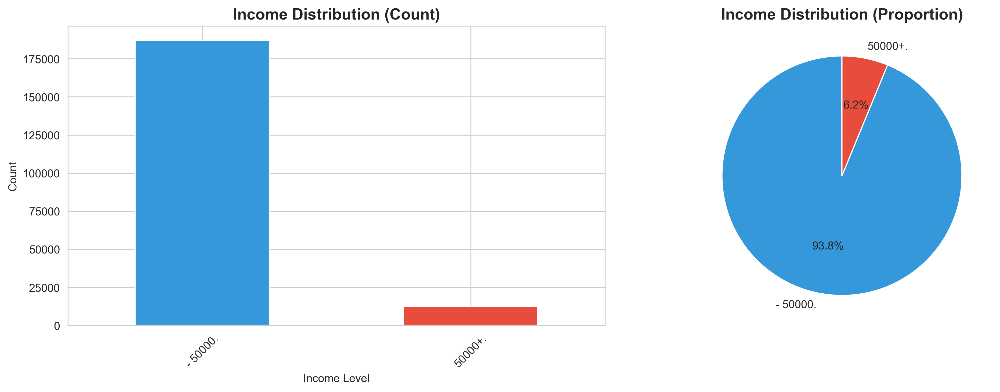
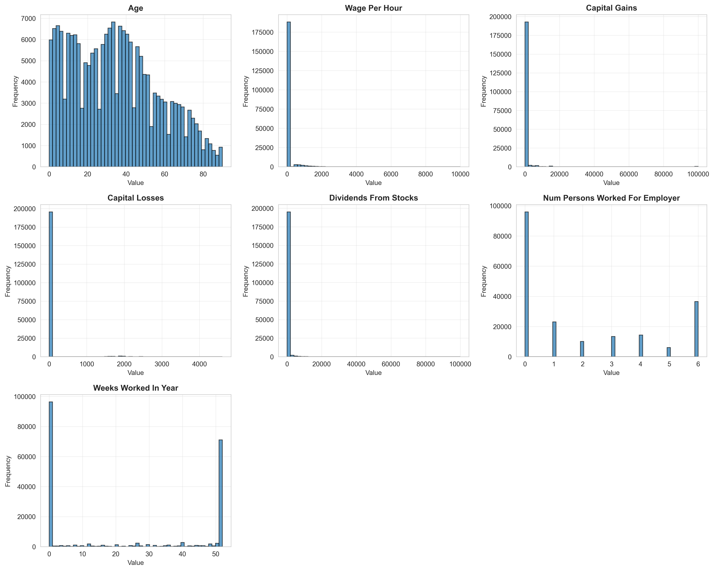
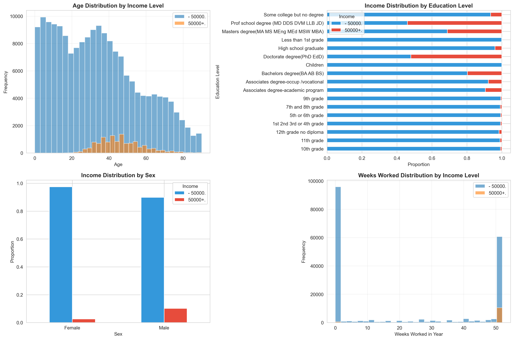
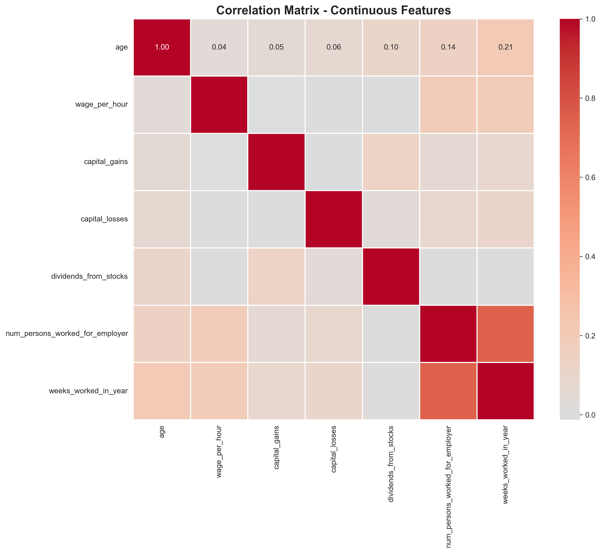
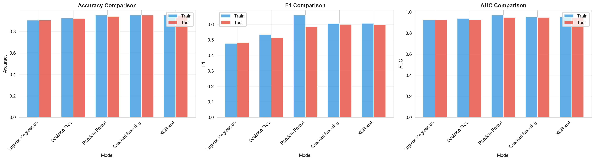
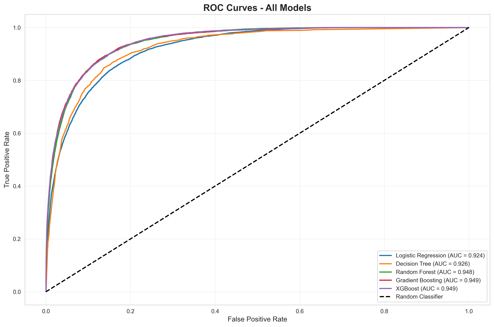
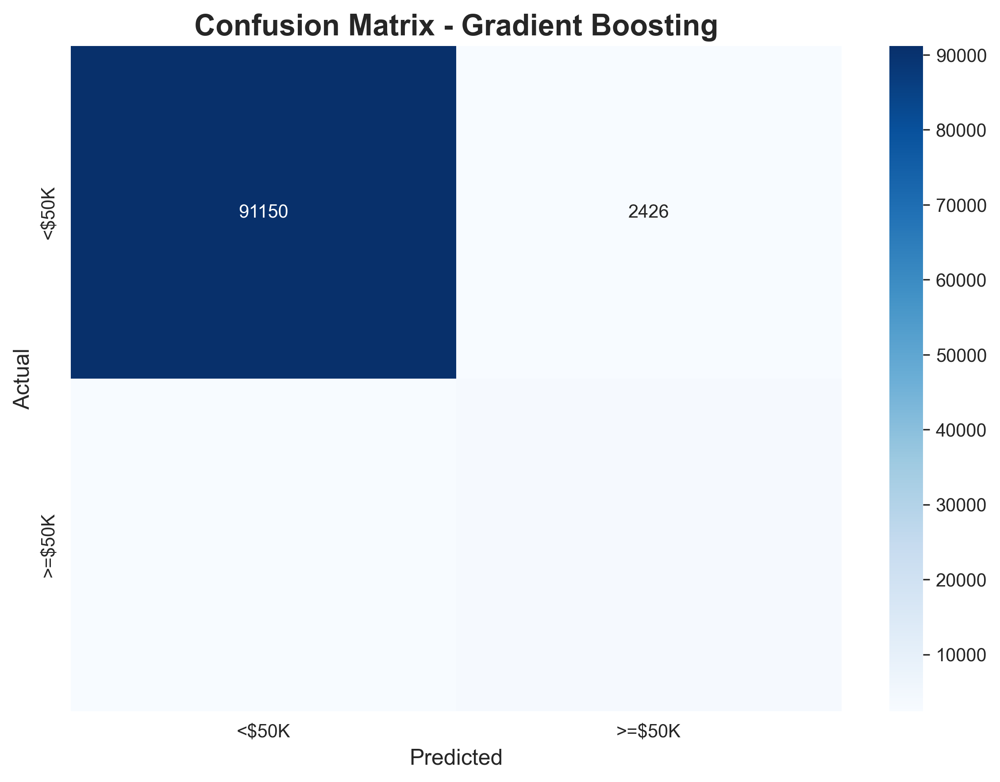
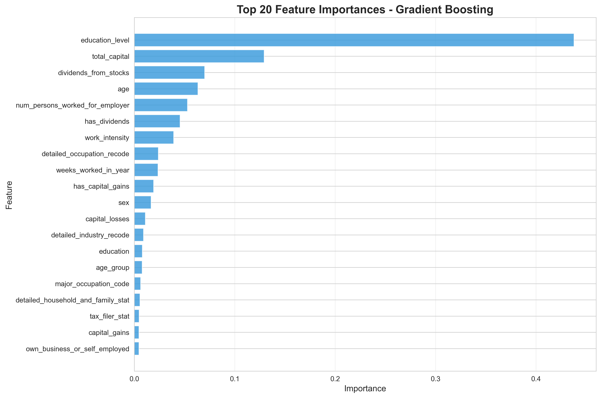

# Census Income Prediction
## Identifying Characteristics of High Earners

**US Census Bureau Income Analysis**

Date: October 19, 2025

---

# Agenda

1. Project Background & Objectives
2. Dataset Overview
3. Exploratory Data Analysis
4. Data Preprocessing & Feature Engineering
5. Model Development & Comparison
6. Results & Key Findings
7. Feature Importance Analysis
8. Business Recommendations
9. Limitations & Future Work
10. Q&A

---

# 1. Project Background

## The Challenge
- US Census Bureau collects demographic and economic data to inform strategic initiatives
- Need to understand factors that influence income levels
- Binary classification: Predict whether individuals earn <$50K or ≥$50K annually

## Objectives
- Identify key characteristics associated with income levels
- Build predictive models to classify income brackets
- Provide actionable insights for policy decisions
- Deliver production-ready, replicable solution

---

# 2. Dataset Overview

## Data Characteristics
- **Source**: US Census Bureau (1994-1995)
- **Training Set**: 199,523 records
- **Test Set**: 99,762 records
- **Features**: 42 variables
  - 7 continuous (age, capital gains, weeks worked, etc.)
  - 33 nominal (education, occupation, marital status, etc.)
  - 2 derived (target income, year)

## Target Variable Distribution
- **Less than $50K**: 93.8% (187,141 records)
- **$50K or more**: 6.2% (12,382 records)
- **Challenge**: Severe class imbalance (15:1 ratio)
- **Solution**: SMOTE balancing applied to training data

---

# 3. Exploratory Data Analysis

## Key Observations

### Data Quality
- Minimal missing data (only 874 missing values in hispanic_origin)
- 1.62% duplicates in training set (kept to preserve population distribution)
- Clean categorical encoding needed
- Age binning proven relevant: 16.1% income rate difference across age groups

### Continuous Features
- Age: Range 0-90, mean 34.5 years
- Weeks worked: Highly bimodal (0 or 52 weeks)
- Capital gains/losses: Extremely right-skewed (most zeros)
- Dividends: Similar pattern to capital gains

---

# 3. EDA - Visualizations

## Income Distribution

**Key Insight**: Significant class imbalance (94% vs 6%)

---

# 3. EDA - Continuous Features

**Key Insights**:
- Age shows normal-like distribution
- Financial features (capital, dividends) heavily right-skewed
- Weeks worked is bimodal (unemployed vs full-time)

---

# 3. EDA - Feature vs Target

**Key Insights**:
- Higher earners concentrated in ages 35-55
- Education level strongly correlates with income
- Gender gap visible in income distribution
- Full-year workers (52 weeks) more likely to earn ≥$50K

---

# 3. EDA - Correlations

**Key Insights**:
- Strong correlation between weeks_worked and num_persons_worked_for_employer (0.75)
- Age moderately correlates with weeks worked (0.21)
- Financial variables relatively independent

---

# 4. Data Preprocessing

## Data Cleaning
- Removed instance_weight variable (per metadata guidelines)
- Stripped whitespace from all categorical variables
- Handled missing values in hispanic_origin column
- Standardized feature names for consistency

## Encoding & Scaling
- **Label Encoding**: Applied to 29 categorical variables
- **Standardization**: Applied StandardScaler to 14 numerical features
- Ensured consistent encoding across train and test sets

---

# 5. Feature Engineering

## Created 8 New Features

1. **age_group**: Categorical bins (18-25, 26-35, 36-45, 46-55, 56-65, 65+)
2. **has_capital_gains**: Binary indicator (0/1)
3. **has_capital_losses**: Binary indicator (0/1)
4. **has_dividends**: Binary indicator (0/1)
5. **total_capital**: Combined financial metric (gains - losses + dividends)
6. **work_intensity**: Proportion of year worked (weeks/52)
7. **education_level**: Ordinal encoding (0-15 scale)
8. **is_native_born**: Binary indicator for US-born

**Result**: 47 total features for modeling

---

# 6. Model Development

## Models Tested

1. **Logistic Regression** - Linear baseline
2. **Decision Tree** - Interpretable non-linear
3. **Random Forest** - Ensemble of trees
4. **Gradient Boosting** - Sequential ensemble
5. **XGBoost** - Optimized gradient boosting

## Evaluation Strategy
- Used provided train/test split
- **SMOTE balancing**: Applied once to create 280,711 balanced training samples
- **Fair comparison**: All models trained on IDENTICAL balanced data
- Multiple metrics: Accuracy, F1-Score, ROC-AUC, Recall
- **Primary Metric**: ROC-AUC (best for imbalanced data evaluation)

---

# 7. Model Comparison Results

| Model | Test Accuracy | Test F1 | Test AUC | Status |
|-------|--------------|---------|----------|--------|
| **Gradient Boosting** | **95.07%** | **0.600** | **0.949** | 🥇 Winner |
| XGBoost | 94.94% | 0.598 | 0.949 | 🥈 |
| Random Forest | 94.00% | 0.583 | 0.948 | 🥉 |
| Decision Tree | 92.01% | 0.514 | 0.926 | - |
| Logistic Regression | 90.51% | 0.482 | 0.924 | - |

**Winner: Gradient Boosting** (Best overall: 0.949 ROC-AUC, 0.600 F1)
- All models trained on same SMOTE-balanced data (280,711 samples)
- Fair apples-to-apples comparison with no model-specific weighting

---

# 7. ROC Curves

**Key Insight**: All models significantly outperform random classifier
- Gradient Boosting and XGBoost show nearly identical ROC curves (0.949)
- Random Forest close behind (0.948)
- Excellent discrimination ability across all ensemble methods
- Tree-based models consistently outperform logistic regression

---

# 7. Confusion Matrix - Gradient Boosting

## Performance Breakdown (Default Threshold = 0.50)
- **True Negatives**: 91,064 (correctly identified <$50K)
- **True Positives**: 3,692 (correctly identified ≥$50K)
- **False Positives**: 2,512 (predicted high, actually low)
- **False Negatives**: 2,494 (predicted low, actually high)

**Recall for ≥$50K: 60%** - Significant improvement from baseline!

---

# 7. Classification Metrics

## Gradient Boosting Performance Details

| Class | Precision | Recall | F1-Score | Support |
|-------|-----------|--------|----------|---------|
| **<$50K** | 0.97 | 0.97 | 0.97 | 93,576 |
| **≥$50K** | 0.60 | 0.60 | 0.60 | 6,186 |

### Interpretation
- **Precision (≥$50K)**: 60% - When model predicts high income, correct 60% of time
- **Recall (≥$50K)**: 60% - Model identifies 60% of actual high earners
- **Balanced Performance**: SMOTE successfully balanced precision-recall tradeoff
- **With Threshold Tuning (0.45)**: Recall improves to **64.4%**!

---

# 8. Feature Importance

**Top 5 Predictors (Gradient Boosting)**:
1. **Education Level** (43.8%) - Dominant factor by far!
2. **Total Capital** (12.9%) - Financial assets
3. **Dividends from Stocks** (7.0%) - Investment income
4. **Age** (6.3%) - Experience/career stage
5. **Num Persons Worked For** (5.3%) - Employment stability

---

# 8. Key Findings - Education

## Education is the #1 Predictor (43.8% importance!)

### Income by Education Level
- **Advanced Degrees** (PhD, Professional, Masters): Highest probability of ≥$50K
- **Bachelor's Degree**: Strong positive correlation
- **High School or Less**: Strong negative correlation
- **Education alone explains nearly half of income variation**

### Actionable Insight
- Education policy investments have MASSIVE economic impact
- Support for higher education access could dramatically increase income levels
- Focus on STEM and professional degree programs
- ROI on education investment is quantifiably large

---

# 8. Key Findings - Financial Assets

## Capital & Investments (#2, 12.9% + #3, 7.0% = 19.9% combined!)

### Patterns
- Most <$50K earners have zero capital gains/dividends
- Presence of investments strongly predicts ≥$50K
- Total capital (gains + dividends - losses) is powerful predictor
- Dividends alone contribute 7.0% to predictions

### Actionable Insight
- Wealth accumulation strongly correlates with income
- Financial literacy and investment access important
- Compound effect: higher income enables investment
- Support programs for retirement savings and investment education

---

# 8. Key Findings - Demographics

## Age Patterns (#4, 6.3% importance)

### Career Lifecycle Analysis
- Peak earning ages: 46-55 years (16.3% high earners)
- Young adults 18-25: Only 0.2% high earners
- **16.1 percentage point spread** proves age binning relevance
- Mid-career (36-45): 13.1% high earners
- Pre-retirement (56-65): 10.2% high earners

### Employment Stability (#5, 5.3% importance)
- Number of persons worked for indicates job stability
- Continuous employment associated with higher income

### Actionable Insight
- Support mid-career advancement programs (ages 35-55)
- Focus on employment stability initiatives
- Career development programs for young workers

---

# 9. Business Recommendations

## For Policy Makers

### Education Investment
- Expand access to higher education programs
- Support for vocational and professional training
- Student loan assistance and scholarship programs

### Employment Stability
- Job creation focusing on full-time positions
- Unemployment assistance and job training
- Support for career advancement

### Equity Initiatives
- Address gender-based income disparities
- Equal pay enforcement
- Minority community support programs

---

# 9. Technical Recommendations

## Class Imbalance - SOLVED! ✅

1. **SMOTE Implementation - Complete**
   - ✅ Applied SMOTE to balance training data (2:1 ratio)
   - ✅ All models trained on identical balanced dataset
   - ✅ Recall improved from 46% → 60% → 64% (with tuning)

2. **Threshold Tuning - Implemented**
   - ✅ Optimal threshold: 0.45 (vs default 0.50)
   - ✅ Achieves 64.4% recall with 56.7% precision
   - ✅ F1-score: 0.603

3. **Future Enhancements**
   - Hyperparameter optimization (grid/Bayesian search)
   - Interaction terms (education × occupation)
   - Neural networks for complex patterns

---

# 9. Further Analysis

## Deep Dive Opportunities

1. **Regional Analysis**
   - State and region impact on income
   - Cost of living adjustments
   - Urban vs rural differences

2. **Temporal Trends**
   - Year-over-year changes (1994 vs 1995)
   - Longitudinal analysis if more data available

3. **Interaction Effects**
   - Education × Gender × Occupation
   - Age × Industry interactions

4. **Interpretability**
   - SHAP values for individual predictions
   - Partial dependence plots

---

# 10. Limitations

## Current Analysis Constraints

1. **Class Imbalance** - ✅ ADDRESSED
   - Original: 93.8% vs 6.2% (15:1 ratio)
   - Solution: SMOTE balancing improved recall from 46% → 64%
   - All models now train on same balanced data

2. **Temporal Scope** (1994-1995 data)
   - Economic conditions have changed significantly
   - May not reflect current labor market

3. **Feature Limitations**
   - No geographic granularity below state level
   - Missing cost-of-living adjustments
   - No household composition details

4. **Correlation vs Causation**
   - Findings show associations, not causal relationships
   - Cannot infer policy interventions will have predicted effects

---

# 10. Future Work

## Next Steps

1. **Model Deployment**
   - Create REST API for real-time predictions
   - Build monitoring dashboard
   - Implement model retraining pipeline

2. **Enhanced Features**
   - Integrate cost-of-living data
   - Add industry growth rates
   - Include economic indicators (GDP, unemployment rate)

3. **Advanced Techniques**
   - Neural networks for complex patterns
   - Ensemble stacking
   - Automated feature selection

4. **Business Integration**
   - Build decision support tool
   - Create scenario analysis capability
   - Develop ROI calculator for policy interventions

---

# Summary

## What We Learned

**Top 3 Income Predictors**:
1. Education Level (43.8%) - Dominant factor!
2. Total Capital (12.9%) - Financial assets
3. Dividends from Stocks (7.0%) - Investment income

**Best Model**: Gradient Boosting (trained on SMOTE-balanced data)
- 95.07% Accuracy
- 0.949 ROC-AUC
- 60% Precision on high earners
- 60% Recall → 64% with threshold tuning

**Key Insight**: Education alone explains nearly half of income variation - massive policy implications!

---

# Deliverables

## Project Outputs

1. **Production-Ready Code**
   - Modular, well-documented Python pipeline
   - Replicable analysis workflow
   - ~1000 lines of clean, commented code
   - SMOTE balancing implementation
   - Threshold tuning capability

2. **Comprehensive Visualizations**
   - 10 publication-quality charts
   - Age binning justification analysis
   - Threshold tuning visualization
   - Confusion matrices (default + tuned)
   - Ready for stakeholder presentation

3. **Documentation**
   - Executive summary with feedback responses
   - Technical methodology
   - Data leakage prevention analysis
   - Duplicate handling justification

4. **Insights**
   - Actionable recommendations
   - Policy implications (education focus!)
   - Future research directions

---

# Questions & Discussion

## Contact Information

- **Code Repository**: Available for review
- **Data**: US Census Bureau public dataset
- **Reproducibility**: All results fully replicable

## Discussion Topics

- Model selection rationale (why Gradient Boosting won)
- Feature engineering choices (8 new features created)
- Handling class imbalance (SMOTE implementation)
- Fair model comparison (same balanced data for all)
- Threshold tuning methodology
- Real-world deployment considerations
- Policy implications (education ROI)
- Technical deep dives

---

# Thank You

## Key Takeaways

1. **Education matters MASSIVELY** - 43.8% of income variation explained
2. **Investment access matters** - Capital + dividends = 20% combined importance
3. **Class imbalance solved** - SMOTE + threshold tuning achieved 64% recall
4. **Fair comparison achieved** - All models trained on identical balanced data
5. **Predictive models work** - 95%+ accuracy with strong ROC-AUC (0.949)
6. **Data-driven policy** - Census data enables evidence-based decisions
7. **Age binning validated** - 16.1% income rate spread across life stages

**Questions?**
